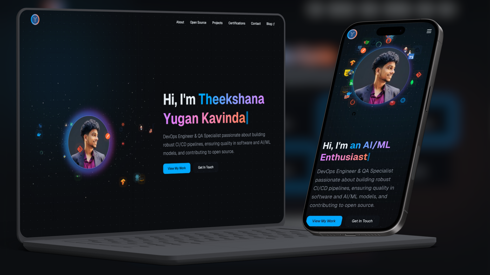

# Yugan Kavinda Portfolio

A modern, interactive **Single Page Application (SPA)** portfolio website showcasing my journey as a QA Engineer, DevOps Engineer, and AI/ML Enthusiast. Built with Next.js, TypeScript, and featuring stunning 3D animations.

## 🌐 Live Demo

[View Live Portfolio](https://www.yugankavinda.me/)



## 🚀 Features

- **Single Page Application (SPA)** - Fast client-side navigation with Next.js App Router
- **Interactive 3D Dragon Animation** - Custom Three.js dragon infinity model with orbit controls
- **Responsive Design** - Optimized for all devices with mobile-first approach
- **Dark/Light Theme** - Seamless theme switching with next-themes
- **Modern UI Components** - Built with shadcn/ui and Radix UI primitives
- **Typewriter Effect** - Dynamic title animation cycling through roles
- **Smooth Scrolling** - Enhanced navigation experience
- **Performance Optimized** - Fast loading with Next.js optimizations

## 🛠️ Tech Stack

### Frontend Framework
- **Next.js 15** - React framework with App Router
- **React 19** - Latest React with concurrent features
- **TypeScript** - Type-safe development

### UI & Styling
- **Tailwind CSS 4** - Utility-first CSS framework
- **shadcn/ui** - Modern component library
- **Radix UI** - Accessible UI primitives
- **Lucide React** - Beautiful icons

### 3D Graphics
- **Three.js** - 3D graphics library
- **@react-three/fiber** - React renderer for Three.js
- **@react-three/drei** - Useful helpers for React Three Fiber

### Forms & Validation
- **React Hook Form** - Performant forms with easy validation
- **Zod** - TypeScript-first schema validation

### Development Tools
- **ESLint** - Code linting
- **PostCSS** - CSS processing
- **Autoprefixer** - CSS vendor prefixing

## 📁 Project Structure

```
myPortfolio/
├── app/                    # Next.js App Router
│   ├── globals.css        # Global styles
│   ├── layout.tsx         # Root layout
│   └── page.tsx           # Home page
├── components/             # React components
│   ├── ui/                # Reusable UI components
│   ├── hero-section.tsx   # Hero with 3D animation
│   ├── about-section.tsx  # About me section
│   ├── devops-section.tsx # DevOps experience
│   └── ...                # Other sections
├── hooks/                 # Custom React hooks
├── lib/                   # Utility functions
├── public/                # Static assets
│   ├── CV/               # Resume files
│   ├── icons/            # Icon assets
│   └── projects/         # Project screenshots
└── styles/               # Additional styles
```

## 🚀 Getting Started

### Prerequisites

- Node.js 18+
- npm, yarn, or pnpm

### Installation

1. **Clone the repository**
   ```bash
   git clone https://github.com/BlockAce01/myPortfolio.git
   cd myPortfolio
   ```

2. **Install dependencies**
   ```bash
   npm install
   # or
   yarn install
   # or
   pnpm install
   ```

3. **Run the development server**
   ```bash
   npm run dev
   # or
   yarn dev
   # or
   pnpm dev
   ```

4. **Open your browser**

   Navigate to [http://localhost:3000](http://localhost:3000) to see the portfolio.

## 📜 Available Scripts

- `npm run dev` - Start development server
- `npm run build` - Build for production
- `npm run start` - Start production server
- `npm run lint` - Run ESLint

## 🎨 Customization

### Personal Information

Update the following files to customize the portfolio:

- `components/hero-section.tsx` - Update name, titles, and description
- `components/about-section.tsx` - Personal information and bio
- `components/experience-section.tsx` - Work experience
- `components/education-section.tsx` - Education background
- `components/projects-section.tsx` - Project showcase
- `components/contact-section.tsx` - Contact information

### Styling

- `app/globals.css` - Global styles and CSS variables
- `tailwind.config.js` - Tailwind configuration
- `components/theme-provider.tsx` - Theme configuration

### 3D Model

The dragon infinity model is located in `components/dragon-infinity.tsx`. You can replace it with your own 3D model or modify the existing one.

## 🌐 Deployment

### Vercel (Recommended)

1. Push your code to GitHub
2. Connect your repository to [Vercel](https://vercel.com)
3. Deploy automatically on every push

### Other Platforms

The app can be deployed to any platform that supports Next.js:

- **Netlify**
- **Railway**
- **Render**
- **AWS Amplify**

## 🤝 Contributing

1. Fork the repository
2. Create a feature branch (`git checkout -b feature/amazing-feature`)
3. Commit your changes (`git commit -m 'Add amazing feature'`)
4. Push to the branch (`git push origin feature/amazing-feature`)
5. Open a Pull Request

## 📄 License

This project is private and proprietary.

## 📞 Contact

**Yugan Kavinda**
- **Portfolio**: [yugankavinda.me](https://www.yugankavinda.me/)
- **LinkedIn**: [theekshana-yugan](https://www.linkedin.com/in/theekshana-yugan/)
- **Email**: yugankavinda@gmail.com

---

Built with ❤️ using Next.js and TypeScript